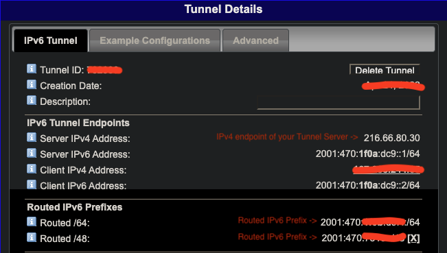

# Quick IPv6-Proxy Installer

A simple shell script for deploying your owns IPv6 proxies.

# How it works

The script establishes 6to4 tunnels. You connect to your server's ipv4 address on a specific port and output one of the ipv6 addresses from your subnet.

## Features

-   Supported networks: `/48`, `/64`
-   Connection protocols: `http(s)` / `socks5`
-   Authentication by username and password (or w/o auth)
-   Custom port numbering (from start)
-   Simultaneous online over 60000 proxies (\*max tcp connections = 10000)
-   Minor resource usage (1000 online proxies = ~ 50mb ram)
-   Auto generating tunnels list in uri format

##

# Installation

```
sudo bash -c "$(wget -qO- https://raw.githubusercontent.com/Sadzurami/IPv6ProxyInstaller/main/main.sh)"
```

# How to start

0. Create account on https://tunnelbroker.net
1. Prepare your own server with a Debian based os.
   It's much better if you only use the server for your proxies and nothing more, because this script changes some system configurations that may affect your other applications. Cheap VPS servers are a great choice.
2. [Create Regular Tunnel](https://tunnelbroker.net/tunnel_detail.php?tid=762030#:~:text=Create%20Regular%20Tunnel) (IPv4 Endpoint = IPv4 address of your server)
3. Install the script on your server with [one simple command](https://github.com/Sadzurami/IPv6ProxyInstaller/blob/main/README.md#installation)
   
4. After installation, the server will be rebooted
5. The list of tunnels is located in your home directory (~/tunnels.txt)

# Requirements

-   Debian based os (tested: Debian 9-11, Ubuntu 18-22)
-   1 CPU, 256 MB RAM
-   The ability to connect to ipv6 addresses
    -   Check: `ping6 -c3 google.com &>/dev/null && echo "Connected successfully" || echo "Connection error"`

# Used

-   [3proxy](https://github.com/z3APA3A/3proxy)
-   [ndppd](https://github.com/DanielAdolfsson/ndppd)
-   some guides from https://blog.vpsville.ru/blog

# Suggestions

If you have any suggestions, please contact me:

-   Email: mail.to.sadzurami@gmail.com
